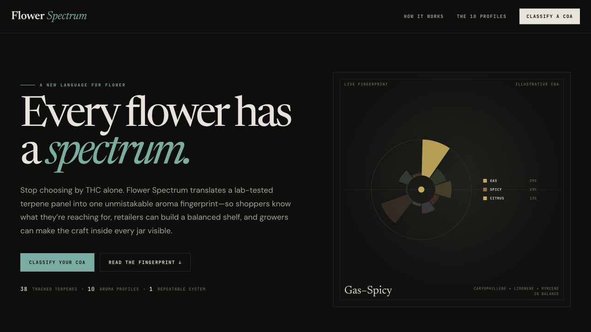

# Flower Spectrum Terpene Fingerprint Classifier

> 🚀 **Live Demo:** [flower-spectrum-coa-classifier.vercel.app](https://flower-spectrum-coa-classifier.vercel.app)
>
> **GitHub Repository:** [cannacre8ive/flower-spectrum-coa-classifier](https://github.com/cannacre8ive/flower-spectrum-coa-classifier)



**Share description:** Turn any cannabis COA into a science-backed aroma fingerprint, buyer sheet, and social card with Flower Spectrum.


Flower Spectrum translates lab-tested cannabis terpene panels into a consistent ten-profile aroma fingerprint and shelf strip. It gives shoppers a clearer signal than THC alone, retailers a way to balance their assortment, and growers a visual language for the chemistry behind their craft.

## Release previews

### Johnny Glaze buyer sheet


### Johnny Glaze social card


### Supplied reference and final implementation


## Quick setup

No build step or environment variables are required.

```bash
python3 -m http.server 4173
```

Open `http://localhost:4173`. PDF upload keeps the source document visible, identifies the terpene-analysis page, reconstructs multi-column tables by page position, and falls back to private in-browser OCR for scanned pages. Keep an internet connection available so the pinned PDF.js and OCR bundles can load. Uploaded files stay in the browser.

Use `examples/johnny-glaze-coa.pdf` for the real six-page demo certificate or `examples/illustrative-coa.pdf` for the synthetic layout fixture. The included Johnny Glaze flower image is loaded into both export formats by default.

## Architecture overview

- `index.html` — stable root entry point.
- `06_18_2026-flower-spectrum-coa-importer-v1_1.html` — app markup, 38-terpene classifier, COA/CSV parser, and interaction layer.
- `app.css` — merged Flower Spectrum visual system and responsive layouts.
- `api/fetch-coa.js` — guarded serverless PDF retriever for public COA links.
- `components/FlowerSpectrumStrainCard.jsx` — reusable buyer/social React component.
- `vercel.json` — static hosting and security headers.
- Legacy source prototypes remain in the root as visual and logic references.

The app has no database. COA data stays in the current browser session and is only persisted when the user downloads the round-trippable CSV export.

## Recent updates

- Added share-ready Open Graph and Twitter metadata plus a 1200 × 630 production screengrab for rich social previews.
- Added versioned release screenshots for the classifier, Johnny Glaze buyer sheet, social card, and the final reference comparison.
- Added real PDF and public COA-link ingestion with automatic terpene-page selection, two-column extraction, source review, and OCR fallback.
- Added Johnny Glaze as a complete demo with its flower photograph, six-page COA, 4.06% terpene panel, buyer sheet, and social card.
- Added image upload to both sales assets and fixed long-panel buyer-sheet clipping with content-aware output height.
- Added an interactive ten-profile fingerprint lab and per-band measured-terpene contribution inspector.
- Added 1600 px buyer-sheet and 1080 × 1350 social PNG export plus a reusable React component download.

See [CHANGELOG.md](CHANGELOG.md) for the complete release ledger.
