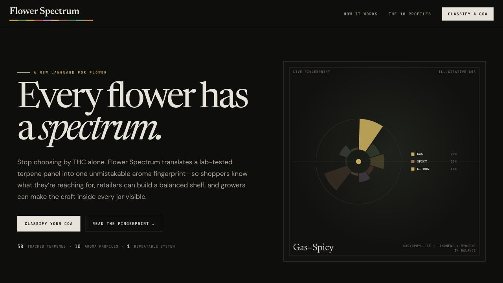
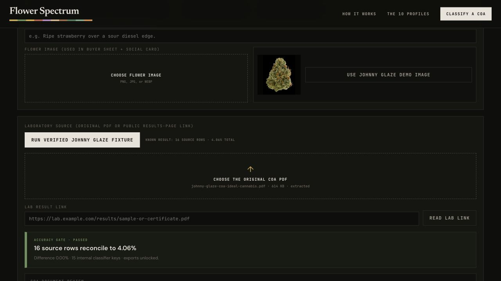
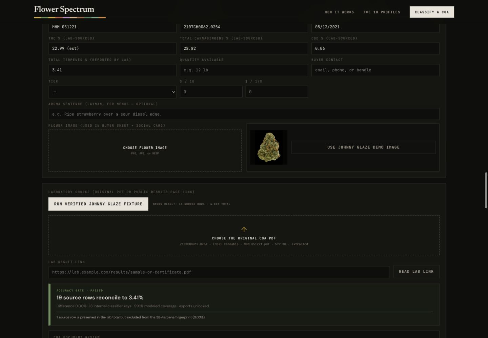
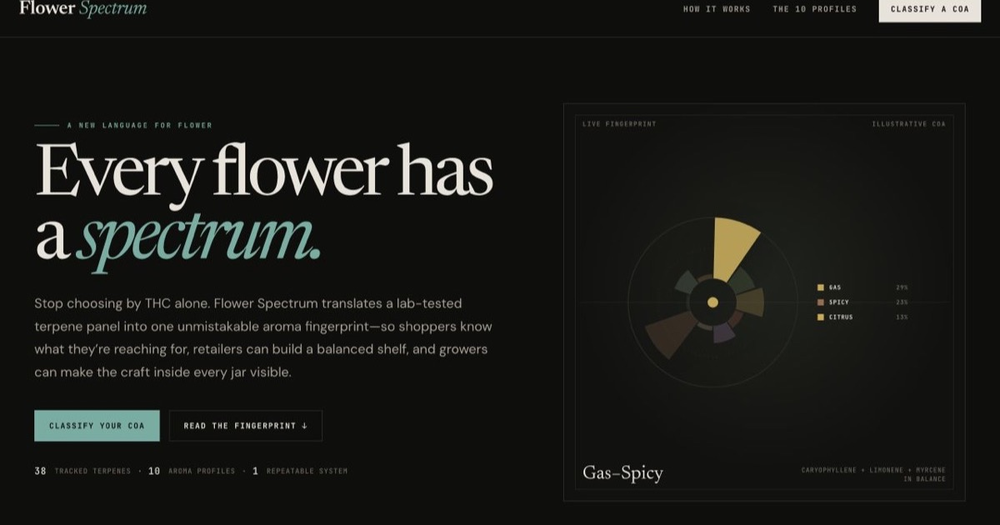
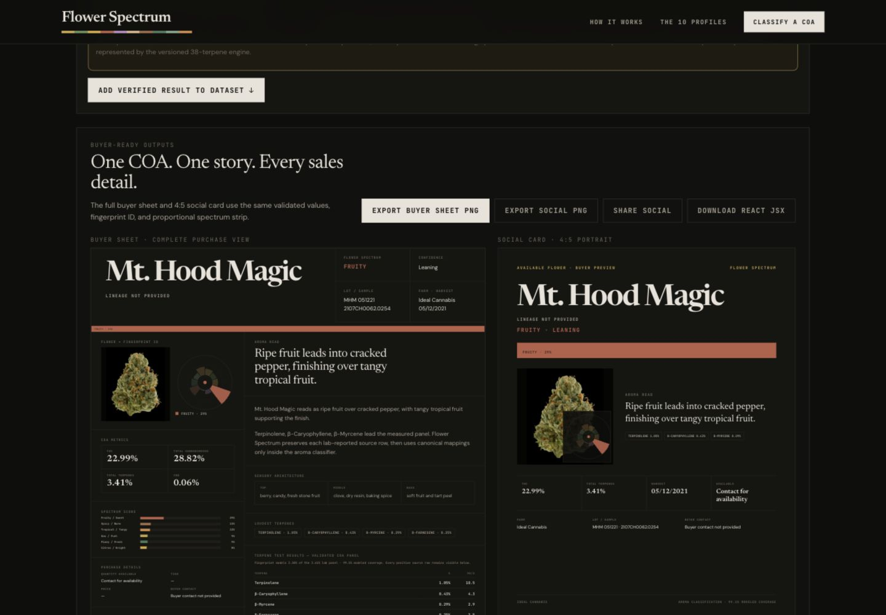
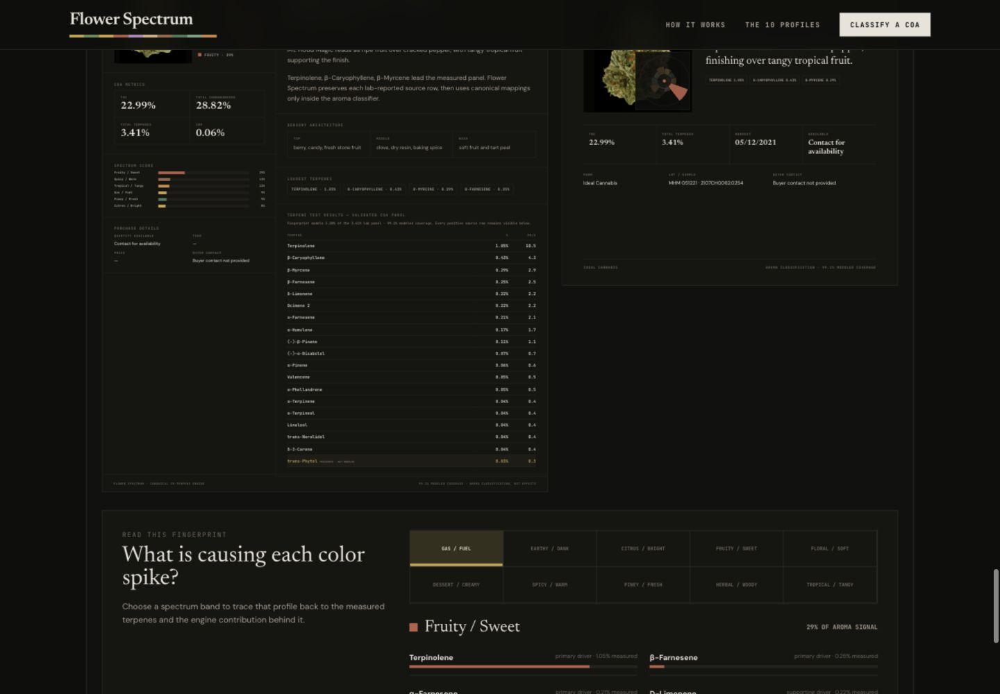
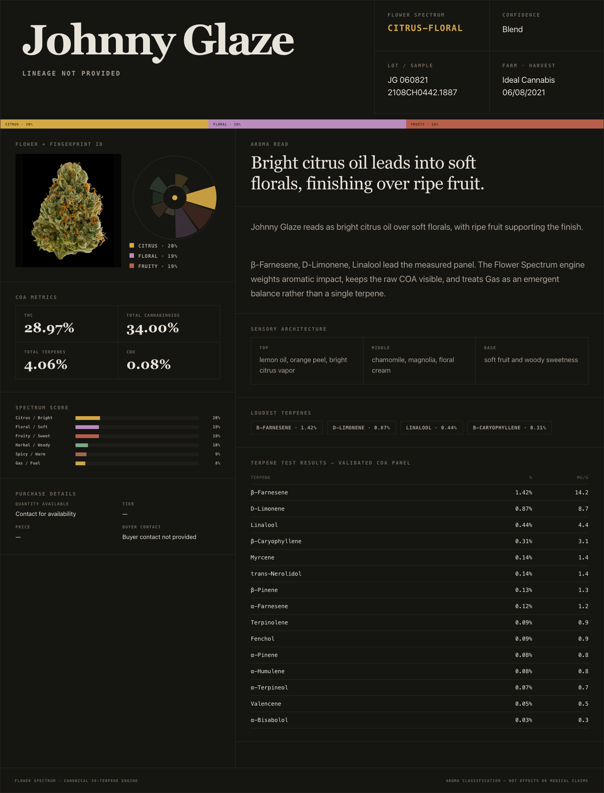
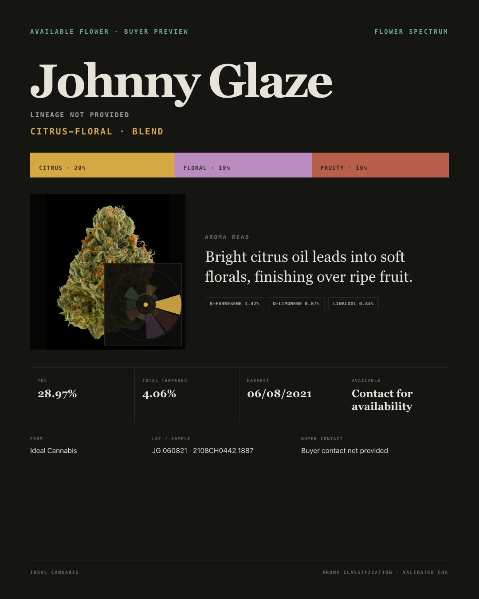
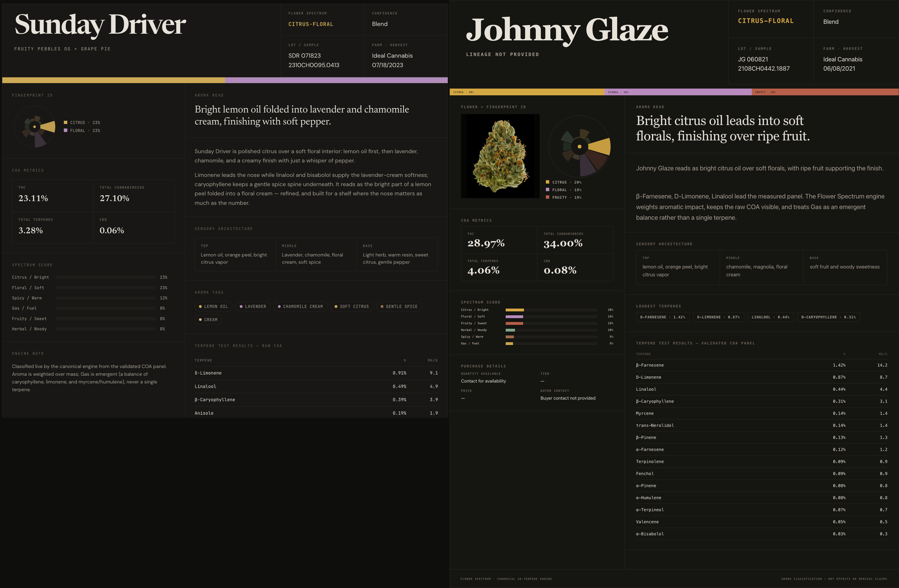
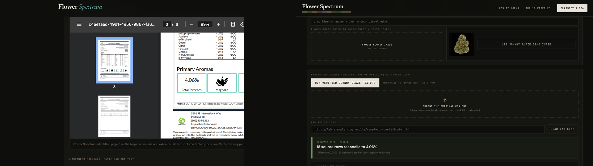

# Flower Spectrum Terpene Fingerprint Classifier

> 🚀 **Live Demo:** [flower-spectrum-coa-classifier.vercel.app](https://flower-spectrum-coa-classifier.vercel.app)
>
> **GitHub Repository:** [cannacre8ive/flower-spectrum-coa-classifier](https://github.com/cannacre8ive/flower-spectrum-coa-classifier)







**Share description:** Turn a verified cannabis COA PDF into an accuracy-gated aroma fingerprint, buyer sheet, and social card with Flower Spectrum.



Flower Spectrum translates lab-tested cannabis terpene panels into a consistent ten-profile aroma fingerprint and shelf strip. It gives shoppers a clearer signal than THC alone, retailers a way to balance their assortment, and growers a visual language for the chemistry behind their craft.

## Release previews

### Mt. Hood Magic live-upload regression





### Johnny Glaze buyer sheet



### Johnny Glaze social card



### Supplied reference and final implementation





## Quick setup

No build step or environment variables are required.

```bash
python3 -m http.server 4173
```

Open `http://localhost:4173`. The only COA inputs are an original laboratory PDF or a public laboratory result-page/PDF link. The parser identifies the terpene-analysis page, reconstructs multi-column tables by position, preserves every positive source row, and requires the row sum to match the laboratory&rsquo;s printed Total Terpenes value within 0.02%. Source reconciliation and classifier mapping are separate: minor positive rows outside the versioned 38-terpene model remain visible and count toward the lab total, while classification requires at least 95% modeled mass coverage. Image-only OCR is review-only and never auto-approved.

Use `examples/johnny-glaze-coa.pdf` for the original verified demo, `examples/mt-hood-magic-coa.pdf` for the 19-row source-coverage regression, or `examples/illustrative-coa.pdf` for the synthetic layout fixture. The included Johnny Glaze flower image is loaded into both export formats by default and can be replaced through the image upload.

## Architecture overview

- `index.html` — stable root entry point.
- `06_18_2026-flower-spectrum-coa-importer-v1_1.html` — app markup, fail-closed PDF parser, 38-terpene classifier, and interaction layer.
- `app.css` — merged Flower Spectrum visual system and responsive layouts.
- `api/fetch-coa.js` — guarded serverless resolver for direct PDF links and public lab result pages containing PDF certificates.
- `components/FlowerSpectrumStrainCard.jsx` — reusable buyer/social React component.
- `vercel.json` — static hosting and security headers.
- Legacy source prototypes remain in the root as visual and logic references.

The app has no database. COA data stays in the current browser session. CSV remains an optional dataset export; it is not accepted as a laboratory source.

## Recent updates

- Fixed the Mt. Hood Magic upload: the parser now preserves `trans-Phytol 0.03%` as a source row even though it is not part of the current 38-terpene fingerprint model, reconciling all 19 rows to the printed 3.41% total.
- Separated source truth from model coverage. MHM passes with 3.38% modeled mass, 0.03% preserved outside the model, and 99.12% coverage; materially incomplete mappings below 95% remain blocked.
- Added MHM to the in-app regression suite and verified all buyer, social, React, and dataset outputs unlock from the supplied six-page certificate.
- Added a fail-closed accuracy gate: Johnny Glaze must produce 16 preserved source rows, 15 internal keys, a 4.06% source sum, a 4.06% lab total, and 0.00% difference before any fingerprint or sales asset appears.
- Fixed the farnesene source-truth defect: β-Farnesene 0.43%, cis-β-Farnesene 0.99%, and α-Farnesene 0.12% remain separate buyer-facing rows even where internal classifier keys aggregate.
- Removed CSV, TXT, and paste ingestion; only original laboratory PDFs and public laboratory result links are accepted.
- Updated the Flower Spectrum wordmark to the brand-guideline off-white treatment with a ten-color spectrum rule and reduced teal in favor of the canonical spectrum palette.
- Added share-ready Open Graph and Twitter metadata plus a 1200 × 630 production screengrab for rich social previews.
- Added versioned release screenshots for the classifier, Johnny Glaze buyer sheet, social card, and the final reference comparison.
- Added real PDF and public COA-link ingestion with automatic terpene-page selection, two-column extraction, source review, and OCR fallback.
- Added Johnny Glaze as a complete demo with its flower photograph, six-page COA, 4.06% terpene panel, buyer sheet, and social card.
- Added image upload to both sales assets and fixed long-panel buyer-sheet clipping with content-aware output height.
- Added an interactive ten-profile fingerprint lab and per-band measured-terpene contribution inspector.
- Added 1600 px buyer-sheet and 1080 × 1350 social PNG export plus a reusable React component download.

See [CHANGELOG.md](CHANGELOG.md) for the complete release ledger.
